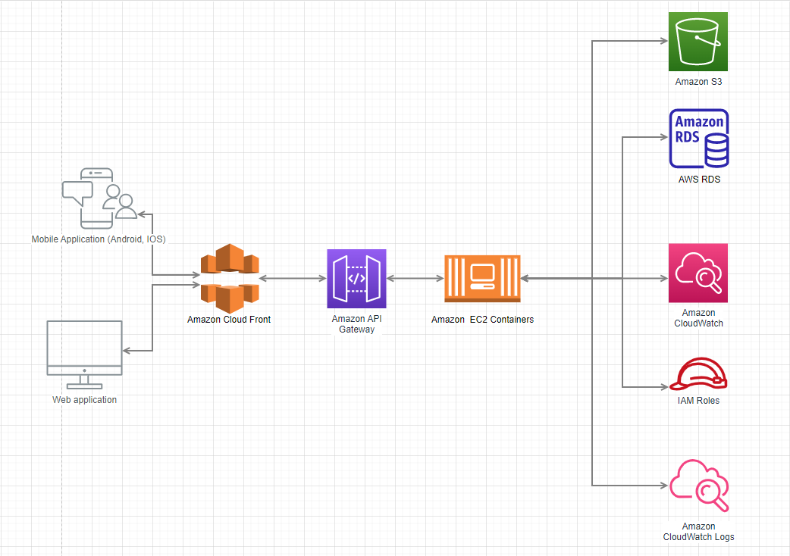

# ANSIBLE AND TERRAFORM FOR PROVISIONING AND MANAGEMENT IaC
---
## Requirements
- WSL or Linux Environmnement for Running (**Ansible Compile Error in Windows Machine**)
- Machine need python3 and pip3 installed before installing Ansible Tools
- Install Ansible For Your Machine to Running the process referenced with Ansible. Just with `pip3 install ansible`
- Feel free your requirements when installing ansible pluggin via [ansible-galaxy](https://galaxy.ansible.com/), that will be provided you many pluggins for provisioning and managing cloud resources by ansible.
- Optionally, you can configure some extensions for easily working with ansible on VSCode
    - [redhat.ansible](https://marketplace.visualstudio.com/items?itemName=redhat.ansible) --> That things for detection with you what pluggin work with
    - [ansible-lint](https://github.com/ansible/ansible-lint) --> You can also download ansible-lint by `pip3 install ansible-lint`

## Structure Folder
```
.
 |-terraform
 | |-modules
 | | |-apigateway
 | | | |-main.tf
 | | | |-variables.tf
 | | |-cloudwatch
 | | | |-cloudwatch.tf
 | | | |-main.tf
 | | | |-variables.tf
 | | |-bucket
 | | | |-main.tf
 | | | |-outputs.tf
 | | | |-variables.tf
 | | |-cloudfront
 | | | |-main.tf
 | | | |-variables.tf
 | | |-vm
 | | | |-main.tf
 | | | |-output.tf
 | | | |-variables.tf
 | | |-iam
 | | | |-main.tf
 | | | |-outputs.tf
 | | | |-variables.tf
 | | |-network
 | | | |-main.tf
 | | | |-outputs.tf
 | | | |-variables.tf
 | | |-postgres
 | | | |-network.tf
 | | | |-main.tf
 | | | |-postgres.tf
 | | | |-variables.tf
 | |-env
 | | |-staging
 | | | |-main.tf
 | | | |-providers.tf
 | | | |-variables.tf
 | | |-production
 | |-settings.json
 |-README.md
 |-ansible
 | |-terraform-runner
 | | |-terraform.yaml
 | | |-inventory
 | | | |-hosts
 | |-ec2
 | | |-data
 | | | |-ansible-role-policies.json
 | | |-remove-runner.yaml
 | | |-create-runner.yaml
 |-.gitignore
 |-script
 | |-auto
 | | |-ansible-runner.sh
```
- Include both Ansible and Terraform for working with. Ansible will responsibility for doing the configuration and interact with Terraform inside Runner
- Terraform will provision the AWS infrastructures

## Idea of that work
<div align="center">
    
    <strong><em><p style="text-align: center;">Source: [One-click environment creation with Terraform & Ansible in under 10' - On The Cloud Kostas Gkountakos](https://medium.com/on-the-cloud/one-click-environment-creation-with-terraform-ansible-in-under-10-6e8d9284f60)</p></em></strong>
</div>

- Ansible have role like 3th party tools, it will do twice job:
    1. Provisioning itself, ansible-runner in AWS Cloud and you can connect it directly with Authentication SSH Key. Ideally, When you doing that job you will control and plan for setting up your Pipeline CI/CD easier than do it with Terraform.
    2. Ansible will not have mission to provision the Cloud, So you can interact with Terraform via Terraform install inside Ansible by copy contents terraform and upgrade that into VM and perform the Terraform workflow.

- Terraform have role work with provision Tool (IaC) for provisioning infrastructure with AWS Provider

## Step to run:
1. Ansible
    - [ec2-folder](./ansible/ec2/) will have options create - destroy runner
        ```
            Command: ansible-playbook <which_ansible_file_you_want> --tags <which_tag_you_want_to_choice>
            
            Tags (Just need only for Create Runner):
                1. create-ssh-key: Create ssh key with name default or pass for it
                2. create-runner: Create Ansible-Runner in cloud using the t2.micro image
                3. view-runner: View and upgrade host for run teraform inside that
        ``` 
    - [terraform-runner-folder](./ansible/terraform-runner/) will have options for you install and copy content for terraform and run terraform flow to working with
        ```
            command: ansible-playbook terraform.yaml --extra-vars <key>=<value> --tags <which_tag_you_want_to_choice>

            Tags:
                1. install-terraform: For install terraform tool for Ansible-Runner
                2. copy_content: Copy content from local terraform into remove with sync configuration
                3. terraform_init_plan: Init and view plan state of terraform before applied (Need --extra-vars)
                4. terraform_apply: applied what terraform plan return (Need --extra-vars)
                5. terraform_display_destroy: Init and view plan state of destroy process will be occured after destruction (Need --extra-vars)
                6. terraform_destroy: Destroy process with destroy plan (Need --extra-vars)
        ```

2. Terraform:
    - So with terraform be come easily to run, just go to right [env](./terraform/env/) and applied terraform work flow
    - With create or update:
        ```
            1. terraform init or terraform init --reconfigure (if you want to make sure with new configure which new update like upgrade provider version, ...)
            2. terraform plan
            3. terraform apply -auto-approve
        ```
    - With destroy:
        ```
            1. terraform init or terraform init --reconfigure (if you want to make sure with new configure which new update likes upgrade provider version, ...) 
            2. terraform plan -destroy
            3. terraform destroy -auto-approve
        ```
3. Script to automation run (**on development process**)

## Infra on the first sight after provisioning
<div align="center">
    
    <strong><em><p style="text-align: center;">Completed Infrastructure After Provisioning AWS</p></em></strong>
</div>


